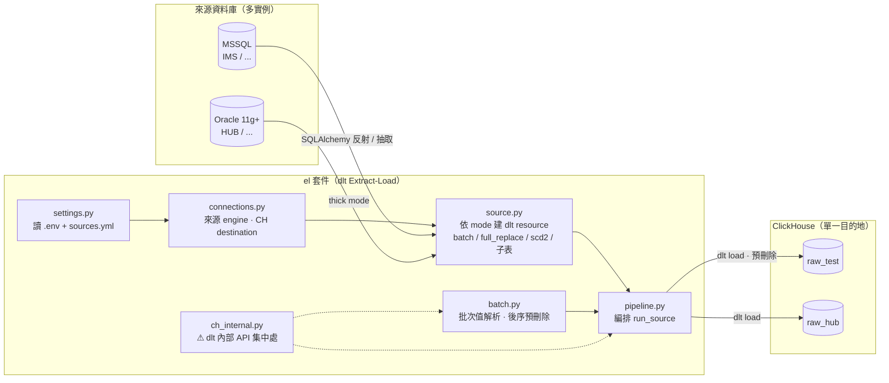
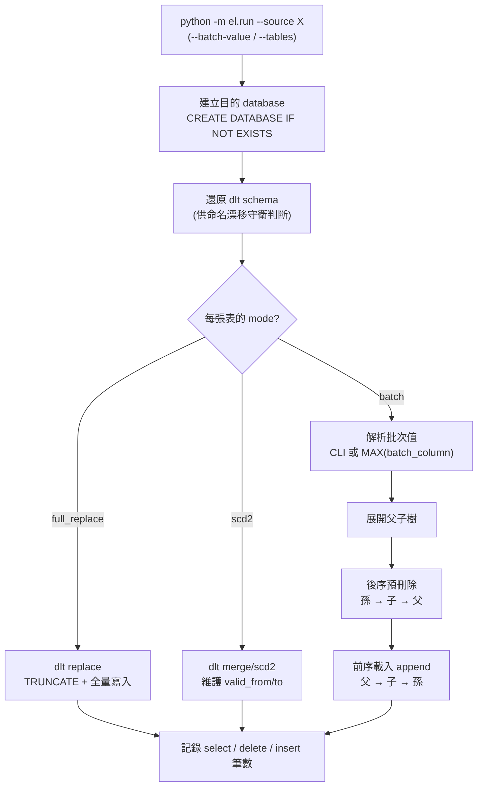

# 資料拋轉 (dlt EL → ClickHouse)

使用 [dlt](https://dlthub.com/) 將多個來源資料庫（MSSQL、Oracle）的指定資料表，
拋轉（Extract-Load）至 ClickHouse。支援依批次（batch）版本刪除重寫、維度全量覆蓋、
緩時變維度（SCD2），以及 batch 父表連動抓取遞迴子表。

> 本階段只做 **EL（抽取 + 載入）**；資料轉換（Transform）未來交由 dbt 處理。

---

## 目錄
- [功能特色](#功能特色)
- [系統架構](#系統架構)
- [專案結構](#專案結構)
- [環境需求](#環境需求)
- [安裝](#安裝)
- [設定](#設定)
- [三種拋轉模式](#三種拋轉模式)
- [batch 子表（主從連動）](#batch-子表主從連動)
- [使用方法](#使用方法)
- [執行流程與 Log](#執行流程與-log)
- [REST API（給 Orchestrator）](#rest-api給-orchestrator)
- [ClickHouse 權限](#clickhouse-權限)
- [注意事項](#注意事項)
- [疑難排解](#疑難排解)
- [給接手者：dlt 內部 API 邊界](#給接手者dlt-內部-api-邊界)

---

## 功能特色

- **多來源實例**：可設定任意多個 MSSQL / Oracle 來源（如 `IMS`、`ERP`、`HUB`…），新增來源不需改程式。
- **來源 schema 分離**：每個來源落在自己的 ClickHouse database（如 `raw_erp`），表存成 `<target_schema>.<table>`。
- **三種拋轉模式**：`batch`（批次刪除重寫）、`full_replace`（全量覆蓋）、`scd2`（緩時變維度，保留歷史）。
- **主從連動**：batch 父表可連帶抓取遞迴巢狀的子表（如訂單→明細→…），依外鍵關聯過濾。
- **內建血緣**：沿用 dlt 內建 metadata（`_dlt_load_id`、`_dlt_id`、`_dlt_loads`；scd2 另有 `_dlt_valid_from/to`）。
- **筆數 Log**：每張表輸出 `select / delete / insert` 筆數。

---

## 系統架構

### 整體資料流



### 單次執行流程



---

## 專案結構

```
dlt/
├── .env.example          # 連線資訊範本（複製成 .env 使用）
├── requirements.txt      # 套件相依（已 pin 版本）
├── config/
│   └── sources.yml       # 來源實例 + 資料表清單 + 每張表的 mode
├── el/                   # 程式套件（Extract-Load）
│   ├── settings.py       # 讀 .env + sources.yml，輸出設定物件
│   ├── connections.py    # 組 MSSQL/Oracle 連線、ClickHouse destination
│   ├── source.py         # 依 mode 建立 dlt resource（含子表遞迴過濾）
│   ├── batch.py          # batch 值解析、ClickHouse 預刪除（後序、含漂移守衛）
│   ├── ch_internal.py    # ⚠ dlt 內部 API 的唯一集中處（升版重點檢查）
│   ├── pipeline.py       # 編排：建庫 → 預刪除 → 載入 → 記數
│   └── run.py            # CLI 進入點
└── docs/superpowers/specs/  # 設計文件
```

---

## 環境需求

- **Python 環境**：conda env **`dbt-env`**（不是 base）。所有指令都要先 `conda activate dbt-env`。
- **MSSQL**：作業系統需安裝 **Microsoft ODBC Driver for SQL Server**（17 或 18）。
- **Oracle**：舊版（11g）需 **thick 模式**，需 64 位元 Oracle Client（見[注意事項](#注意事項)）。
- **ClickHouse**：目的地，需有對應權限的帳號（見 [ClickHouse 權限](#clickhouse-權限)）。

---

## 安裝

```powershell
conda activate dbt-env
pip install -r requirements.txt
```

主要相依（已於 `requirements.txt` pin 版本）：`dlt==1.28.1`、`clickhouse-connect`、
`clickhouse-driver`、`SQLAlchemy`、`pyodbc`、`oracledb==2.5.1`、`python-dotenv`。

---

## 設定

### 1. 連線資訊：`.env`

複製範本後填入實際值（`.env` 已被 git 忽略）：

```powershell
copy .env.example .env
```

- 來源連線變數以「**實例名稱（大寫）**」為前綴，須與 `sources.yml` 的 key 一致。
- 新增來源：複製對應 type 區塊、改前綴名稱即可，程式不用改。

```dotenv
# MSSQL 型實例（前綴 = sources.yml 的 key，如 IMS）
IMS_HOST=
IMS_PORT=1433
IMS_DATABASE=
IMS_USER=
IMS_PASSWORD=
IMS_ODBC_DRIVER=ODBC Driver 18 for SQL Server

# Oracle 型實例（如 HUB）
HUB_HOST=
HUB_PORT=1521
HUB_SERVICE_NAME=
HUB_USER=
HUB_PASSWORD=

# Oracle 11g thick 模式所需的 64 位元 Client 目錄（含 oci.dll）；全域設定
ORACLE_CLIENT_LIB_DIR=D:\oracle_client\12.2.0\64\product\12.2.0\client_1

# ClickHouse（單一目的地）
# CLICKHOUSE_DATABASE 是 bootstrap 用的既有資料庫（通常 default）；
# 各來源實際落地的 database 由 sources.yml 的 target_schema 決定（會自動建立）
CLICKHOUSE_HOST=
CLICKHOUSE_HTTP_PORT=8123
CLICKHOUSE_PORT=9000
CLICKHOUSE_DATABASE=default
CLICKHOUSE_USER=default
CLICKHOUSE_PASSWORD=
CLICKHOUSE_SECURE=false
```

### 2. 來源與資料表：`config/sources.yml`

```yaml
sources:
  IMS:                       # 來源實例名稱（= .env 前綴、= CLI --source 值）
    type: mssql              # mssql | oracle
    schema: dbo              # 來源端 schema（Oracle 為 owner，例如 EDI）
    target_schema: raw_test  # 目的地 ClickHouse database（會自動建立）
    tables:
      - name: IMS_P_Case
        mode: batch
        batch_column: Edition
      - name: IMS_P_Edition
        mode: full_replace

  HUB:
    type: oracle
    schema: EDI
    target_schema: raw_hub
    tables:
      - name: ZZ_MODEL_INFO
        mode: full_replace
```

---

## 三種拋轉模式

| 模式 | 用途 | 需要參數 | 寫入策略 |
|------|------|---------|---------|
| `batch` | 一批一批進來的版本／批次資料 | `batch_column`（欄位名）＋ 批次值（CLI 帶入，空則抓最新） | 來源以 `WHERE batch_column = 值` 過濾；ClickHouse 先 `DELETE` 該批次再 append |
| `full_replace` | 維度小表 | 無 | 來源整表讀取；ClickHouse 整表清空（TRUNCATE）後全量寫入 |
| `scd2` | 緩時變維度（保留歷史版本） | `scd_natural_key`（自然鍵，可多欄） | dlt merge/scd2，自動維護 `_dlt_valid_from` / `_dlt_valid_to` |

**批次值（batch）解析**：CLI 帶 `--batch-value` 就用該值；未帶則對每張 batch 表各自查
`SELECT MAX(batch_column)` 取最新值。**每次執行處理單一批次值。**

---

## batch 子表（主從連動）

batch 父表可連帶抓取子表（可遞迴多層）。關聯為**單欄**：子表 `child_key` 對應父表 `parent_key`。

```yaml
tables:
  - name: Orders
    mode: batch
    batch_column: Edition
    children:
      - name: SaleItems
        child_key: PID          # SaleItems 上的 FK 欄
        parent_key: ID          # 對應 Orders 的欄
        children:               # 可再往下遞迴
          - name: SaleItemDetail
            child_key: ItemPID
            parent_key: ItemID  # 對應 SaleItems 的欄
```

- 子表只抓「關聯到本批次父列」的資料：
  `SELECT * FROM SaleItems WHERE PID IN (SELECT ID FROM Orders WHERE Edition = 值)`（可逐層巢狀）。
- 重跑同批次：**後序**（孫→子→父）先刪掉本批次父列所關聯的子孫列、再刪父列，接著重新載入 → 不殘留孤兒列。
- 子表僅在父表底下巢狀定義，**不可**另列為 top-level 表，也**不可**設 `mode`/`batch_column`。

---

## 使用方法

```powershell
conda activate dbt-env

# 跑整個來源（所有表各自依 mode 處理）
python -m el.run --source IMS

# batch 表指定批次值
python -m el.run --source IMS --batch-value 2025W34

# 只跑指定表
python -m el.run --source IMS --tables IMS_P_Case,IMS_P_Edition
```

| 參數 | 說明 |
|------|------|
| `--source`（必填） | 來源實例名稱，對應 `sources.yml` 的 key |
| `--batch-value`（選填） | batch 模式使用；未帶則各表抓各自 `batch_column` 最新值 |
| `--tables`（選填） | 逗號分隔的表子集；未帶則跑該來源所有表 |

---

## 執行流程與 Log

每次執行：**建立目的 database →（batch）後序預刪除 → 前序載入 → 逐表記數**。

Log 範例（父表 + 兩層子表）：

```
INFO el: [ORD] target ClickHouse database = raw_ord
INFO el: [ORD.Orders] mode=batch | select=791 delete=0 insert=791
INFO el: [ORD.Orders > SaleItems] mode=batch-child | select=2310 delete=0 insert=2310
INFO el: [ORD.Orders > SaleItems > SaleItemDetail] mode=batch-child | select=5120 delete=0 insert=5120
```

- **select**：從來源實際讀出的筆數
- **delete**：ClickHouse 預刪除筆數（僅 batch；full_replace 的清空為 TRUNCATE，不計於此）
- **insert**：載入到目的表的筆數

---

## REST API（給 Orchestrator）

`api/` 套件以 FastAPI 包裝拋轉，供外部 Orchestrator 觸發。**同步阻塞**（POST 等到完成才回傳）、
**每來源互斥**（同一來源同時只跑一個）、**OAuth2 Token Introspection** 驗證。

### 啟動
```powershell
conda activate dbt-env
python -m uvicorn api.app:app --host 0.0.0.0 --port 8080 --workers 1
```
> ⚠ 必須 **單一 worker**（`--workers 1`）：每來源互斥鎖存於記憶體，多 worker 會失效。
> Swagger 文件：啟動後開 `http://<host>:8080/docs`。

### 端點

| Method | 路徑 | 需驗證 | 說明 |
|--------|------|:---:|------|
| `GET`  | `/health` | ✕ | 存活檢查 |
| `GET`  | `/sources` | ✓ | 列出所有來源與其表/mode |
| `GET`  | `/sources/{name}` | ✓ | 單一來源詳情 |
| `POST` | `/sources/{name}/run` | ✓ | 同步觸發拋轉，阻塞至完成 |

`POST /sources/{name}/run` body（皆選填）：`{ "batch_value": "2025W34", "tables": ["IMS_P_Case"] }`

**狀態碼**：`200` 成功／`400` 參數或設定錯誤／`401` 無效 token／`403` scope 不足／
`404` 來源不存在／`409` 該來源正在執行／`500` 拋轉失敗／`503` IdentityServer 不可達。

### 認證
受保護端點需帶 `Authorization: Bearer <access_token>`。API 從
`{IDENTITY_SERVER_HOST}/.well-known/openid-configuration` 找 introspection 端點，
用 `.env` 的 client_id/secret 驗證 token 的 `active`（與選填的 scope）。相關 `.env`：

```dotenv
API_HOST=0.0.0.0
API_PORT=8080
IDENTITY_SERVER_HOST=https://ids.example.com
IDENTITY_SERVER_CLIENT_ID=el-api
IDENTITY_SERVER_CLIENT_SECRET=
OAUTH_REQUIRED_SCOPE=el.run        # 選填，未設則只檢查 active
OAUTH_TIMEOUT_SECONDS=5
```

範例：
```bash
curl -X POST http://localhost:8080/sources/IMS/run \
  -H "Authorization: Bearer $TOKEN" -H "Content-Type: application/json" \
  -d '{"batch_value":"2025W34"}'
```

---

## ClickHouse 權限

以**具 GRANT 權限的管理者**（如 `default`）對拋轉帳號授權。以帳號 `etl_user`、目的 schema `raw_test` 為例：

```sql
-- schema 反射 + 系統表查詢（batch 存在檢查用 system.tables）
GRANT SELECT ON INFORMATION_SCHEMA.COLUMNS TO etl_user;
GRANT SELECT ON system.tables  TO etl_user;
GRANT SELECT ON system.columns TO etl_user;

-- 自動建立目的 database（程式會 CREATE DATABASE IF NOT EXISTS）
GRANT CREATE DATABASE ON *.* TO etl_user;

-- 在目的 schema 內操作；ALTER 涵蓋 batch 的 lightweight DELETE，TRUNCATE 供 full_replace
GRANT SELECT, INSERT, ALTER, TRUNCATE, CREATE TABLE, DROP TABLE ON raw_test.* TO etl_user;
```

多個目的 schema 可各授權一次，或對 ETL 專用帳號改用 `ON *.*`（較寬鬆但省事）。
確認：`SHOW GRANTS FOR etl_user;`

---

## 注意事項

- **conda 環境**：一律在 `dbt-env` 執行（`conda activate dbt-env`）。`dlt` 只裝在此環境。
- **識別名大小寫**：`sources.yml` 內可直接寫來源的真實名稱。
  - Oracle：物件名慣例為大寫（如 `EDI`、`ZZ_MODEL_INFO`），程式會自動正規化。
  - `schema` 對 Oracle 是 **owner**（通常等於帳號名，如 `EDI`），不是 service name。
- **Oracle 11g（thick 模式）**：
  - `oracledb` 已 pin **2.5.1**（4.x 的 thick 模式要求 Client 19.1+）。
  - 需 **64 位元** Oracle Client，於 `.env` 的 `ORACLE_CLIENT_LIB_DIR` 指定；機器上的 12.2 client 可連 11g。
- **MSSQL ODBC**：`.env` 的 `*_ODBC_DRIVER` 需與實際安裝相符（如只有 17，就填 `ODBC Driver 17 for SQL Server`）。
- **批次**：每次執行處理單一批次值；重跑同批次會先刪除該批次再重寫（不重複）。
- **full_replace**：走 dlt `replace`（TRUNCATE + 全量寫入），帳號需 `TRUNCATE` 權限。
- **dlt 版本**：`dlt` 已 pin `1.28.1`。升版前請看[下方 dlt 內部 API 邊界](#給接手者dlt-內部-api-邊界)。

---

## 疑難排解

| 錯誤 | 原因與處理 |
|------|-----------|
| `sqlalchemy.exc.NoSuchTableError: <表>` | 反射時於指定 `schema`（Oracle 為 owner）找不到表。確認 `sources.yml` 的 `schema` 是**該表真正的 owner**（例如是 `EDI` 而非 `APP`）。 |
| `DPY-3010: ... not supported by python-oracledb in thin mode` | Oracle 太舊（11g）不支援 thin 模式。需 thick 模式：確認 `oracledb==2.5.1` 且 `ORACLE_CLIENT_LIB_DIR` 指向 64 位元 client。 |
| `DPI-1050: Oracle Client library is at version 12.2 but version 19.1 or higher is needed` | 用到 oracledb 4.x。降版：`pip install "oracledb==2.5.1"`。 |
| `Not enough privileges ... INFORMATION_SCHEMA.COLUMNS` | ClickHouse 帳號缺權限，見 [ClickHouse 權限](#clickhouse-權限)。 |
| `Not enough privileges ... TRUNCATE ON ...` | full_replace 需 `TRUNCATE`：`GRANT TRUNCATE ON <schema>.* TO <user>;` |
| `RuntimeError: Pre-delete target ... not found ... but dlt's schema says this table exists` | 命名漂移守衛觸發（多半是 dlt 升版改了命名）。檢查 `el/ch_internal.py`。 |
| batch 表「有結構、沒資料」（select=0） | 批次值與資料不符：確認 `batch_column` 名稱與帶入的 `--batch-value`（或 `MAX` 抓到的值）確實存在。 |

---

## 給接手者：dlt 內部 API 邊界

刪除步驟必須算出「dlt 實際寫入的實體表名」，因此用到少數 **dlt 非公開內部 API**。
這些呼叫全部**集中在 [`el/ch_internal.py`](el/ch_internal.py)** 一個檔（檔頭有詳細警語）。

- **升版 dlt 前**：重點檢查此檔。若 dlt 改了方法名/簽名，會**當場 `AttributeError/TypeError`**（好抓）。
- **命名漂移守衛**：`el/batch.py` 的預刪除若發現「dlt 認為某表存在、但算出的實體名查不到」，會
  **`raise RuntimeError`** 而非安靜略過——避免升版後悄悄把資料寫重複。
- **未來方向（非必要）**：可把 ClickHouse 這層也改用 SQLAlchemy 操作（像 `source.py` 對來源那樣），
  更好測試／可換 DuckDB；但代價是要自行維護一套與 dlt 對齊的命名邏輯（換一種風險）。

設計文件見 [`docs/superpowers/specs/`](docs/superpowers/specs/)。
